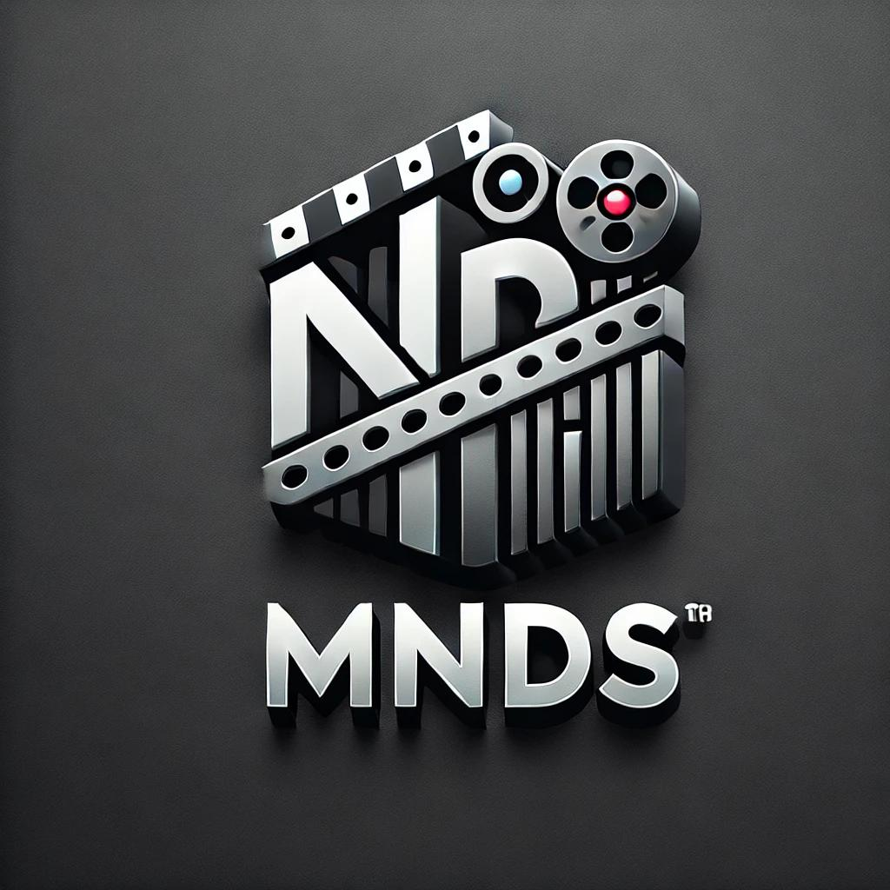

<p align="center">
  
</p>

# MndS

MndS is a comprehensive entertainment platform where users can explore movies and web series, view ratings, and get news about new releases. The platform supports multiple user roles including regular users and publishers

## User Roles

### Regular User

- Browse movies and series
- View ratings and news
- Manage personal profile
- Access personalized recommendations

### Publisher

- Create and publish news articles
- Manage content
- Access publisher dashboard
- All regular user features

## Features

- User authentication (login/signup)
- Role-based access control
- Search functionality for movies and series
- News publishing system
- Rating and review system
- Responsive design for all devices
- Publisher content management

## Technologies Used

- **Frontend:** React.js, Tailwind CSS
- **Backend:** JSON Server (for a simple server setup)

## Project Structure

The project is divided into two separate frontends:

1. **User Frontend:** Accessible at `localhost:3000`


## Installation

1. Clone the repository:

   ```sh
   git clone https://github.com/yourusername/mnds.git
   cd mnds
   ```

2. Install dependencies:

   ```sh
   npm install
   ```

3. Start the JSON Server:

   ```sh
   npm run json-server
   ```

4. Start the User Frontend:

   ```sh
   npm start
   ```

5. Start the Admin Frontend:
   ```sh
   npm run start-admin
   ```

## Expected Completion

The application is expected to be completed by **29th January 2025**.

## License

This project is licensed under the MIT License.

## Developed

This project developed by ARM. Afrih (NDT Graduate and Intern Software Engineer)
